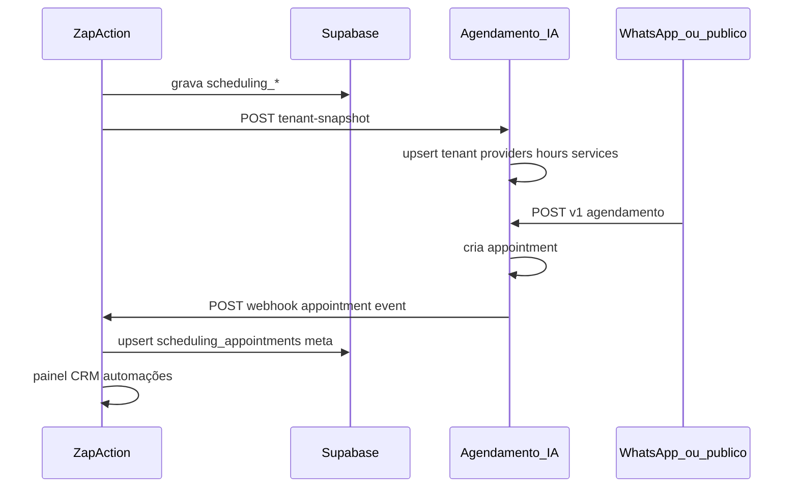

# Plano técnico de continuação — integração ZapAction ↔ Agendamento IA

**Versão:** 1.0  

> **Leitura rápida:** Não são “dois planos rivais”. Este ficheiro é o **plano técnico de execução**. O **[`plano_agenda_zapaction_completa.md`](plano_agenda_zapaction_completa.md)** é o **plano de produto/âmbito** (mesmo roadmap, outra camada). Para implementar código, segue **este** documento (§4–§9); para alinhar stakeholders, usa o outro.

**Premissa obrigatória:** **não** há banco de dados partilhado entre projetos; **não** ligar o ZapAction ao `DATABASE_URL` do Agendamento IA. Integração exclusivamente por **HTTP, webhooks, eventos e contratos estáveis**.

---

## 1. Contexto atual

### ZapAction (`agente-ia`)

- Fluxos, WhatsApp, multi-turno, nó **`agendamento_ia`** (ponte conversacional + estado + chamada ao motor — **não** é o motor de agenda).
- **Supabase**, painel principal, tabelas **`scheduling_*`**, engine conversacional.
- **Já implementado:** push de configuração → Agendamento IA via **`tenant-snapshot`** ([`services/agendamento_ia_sync.py`](../services/agendamento_ia_sync.py), painel [`panel/routes/scheduling.py`](../panel/routes/scheduling.py)).

### Agendamento IA (`agendamento-ia`)

- Serviço especializado: **SQLAlchemy**, **`DATABASE_URL`** próprio.
- Modelos: `tenants`, `providers`, `working_hours`, `appointments`, `services`, etc.
- Motor: slots, booking, **`POST /v1/agendamento`**, sync recebido em **`POST /v1/integrations/zapaction/tenant-snapshot`**.

### Decisão arquitetural (inviolável)

| Fazer | Não fazer |
|-------|-----------|
| HTTP APIs, webhooks, eventos | BD único entre serviços |
| Contratos JSON versionados | ZapAction escrever direto no Postgres do Agenda |
| Deploy e migrações independentes | Múltiplos writers no mesmo schema sem fronteira |

**Motivos:** reduzir acoplamento, evitar migrações sincronizadas à mão, preservar rollback e evolução por domínio.

---

## 2. Arquitetura desejada (fluxo de dados)



1. **Configuração** no painel ZapAction → grava Supabase → **snapshot** → Agenda alinha modelo interno.  
2. **Utilizador agenda** (WhatsApp / fluxo / página pública) → motor no **Agendamento IA** cria `AppointmentRow`.  
3. **Evento** Agenda → **webhook** → ZapAction atualiza Supabase + painel/CRM/automações conforme política.

---

## 3. Papel do nó `agendamento_ia`

- **Continua:** ponte conversacional, controlo de estado na conversa, chamada ao motor (HTTP interno ou `AGENDAMENTO_IA_WEBHOOK_URL`).
- **Não passa a ser:** motor de slots, persistência de agenda canónica, ou substituto do serviço Agenda.

O **motor de agenda** permanece no projeto **Agendamento IA** (e/ou motor interno Supabase **só** quando o produto optar explicitamente por esse caminho — hoje coexistem; a integração híbrida não mistura BD).

---

## 4. Fases de implementação (incremental)

### Fase 0 — Inventário e contratos (sem código de produção crítico)

- [x] Documentar payloads: [`agendamento_ia_sync.py`](../services/agendamento_ia_sync.py), [`agendamento_ia_integracao_checklist.md`](agendamento_ia_integracao_checklist.md).
- [x] Contrato webhook reverso §5.2 + runbook [`agendamento_ia_runbook.md`](agendamento_ia_runbook.md).
- [x] Matriz **cliente_id** = UUID ZapAction; `.env.example` + `scripts/verify_agendamento_ia_env.py`.

### Fase A — Webhook Agenda → ZapAction (prioridade)

**Agendamento IA**

- [ ] Variáveis: `ZAPACTION_APPOINTMENT_WEBHOOK_URL`, `ZAPACTION_WEBHOOK_SECRET` (ou reutilizar padrão de assinatura acordado).
- [ ] Hook **após commit** bem-sucedido de appointment (create / cancel / reschedule) — ponto único (ex. serviço de booking ou listener pós-`commit`).
- [ ] Cliente HTTP assíncrono (thread ou background task) com **retry exponencial** e timeout curto na request principal.
- [ ] Payload JSON versionado (ver secção 5).

**ZapAction**

- [x] Rota `POST /webhook/agendamento-ia/appointments` (prefixo alinhado com outros webhooks em [`app.py`](../app.py) / blueprints).
- [x] Validação **HMAC** (corpo + timestamp) ou Bearer dedicado + lista de IPs opcional.
- [x] **Idempotência:** `event_id` repetido ignorado; upsert por `external_agenda_appointment_id` (migração `026`).
- [x] **Upsert** na tabela de agendamentos; coluna **Origem** no wizard.

**Testes**

- [x] Testes unitários no ZapAction: assinatura válida/ inválida.
- [ ] Teste manual ou integração com payload fixture no Agenda.

### Fase B — Sincronização e falhas

- [ ] Log estruturado + alerta se webhook falhar N vezes seguidas.
- [x] (Opcional) Job stub no ZapAction: [`services/jobs/agendamento_ia_reconcile.py`](../services/jobs/agendamento_ia_reconcile.py) — ativo quando Agenda expuser `GET .../appointments/export`.
- [x] **Cancelamento** painel → Agenda: [`services/agendamento_ia_cancel.py`](../services/agendamento_ia_cancel.py) (`operation: cancel`).

### Fase C — UX e produto

- [x] Painel: coluna “Origem” (ZapAction / Agenda), última sync (sessão).
- [x] Documentar no README / runbook variáveis `.env` dos dois lados ([`agendamento_ia_runbook.md`](agendamento_ia_runbook.md), [`.env.example`](../.env.example)).

### Fase D — Automations / CRM (quando aplicável)

- [ ] Disparar pipelines existentes após upsert de appointment (evento interno ZapAction), sem acoplar lógica ao Agenda.

---

## 5. Contratos JSON

### 5.1 Configuração (já existente)

Ver docstring em [`services/agendamento_ia_sync.py`](../services/agendamento_ia_sync.py): `event: zapaction.scheduling.tenant_snapshot`, `request_schema_version: 1`, `cliente_id`, `clinic`, `professionals`, `services`.

### 5.2 Evento reverso (proposta v1)

Campos **`event_id`** (UUID único por entrega lógica) e **`occurred_at`** (ISO-8601 UTC) são **recomendados** desde a primeira versão: suportam **replay seguro**, **auditoria**, **debugging** e **reconciliação** (Fase B) sem depender só do `appointment_id`.

```json
{
  "event": "appointment.created",
  "request_schema_version": 1,
  "event_id": "<uuid novo por emissão ou por tentativa de entrega>",
  "occurred_at": "2026-05-14T12:00:00Z",
  "cliente_id": "<uuid>",
  "appointment_id": "<uuid Agenda>",
  "status": "confirmed",
  "starts_at": "<iso-8601>",
  "ends_at": "<iso-8601>",
  "provider_id": "<uuid|null>",
  "service_id": "<uuid|null>",
  "remote_id": "<string>",
  "contact": { "phone": "", "name": "" },
  "metadata": {}
}
```

- **`event_id`:** gerar no Agenda por “fatia de entrega” (ex.: novo UUID em cada retry se quiseres distinguir tentativas no log) **ou** estável por transição de negócio — documentar a escolha; o receptor pode guardar últimos `event_id` por `appointment_id` para detetar duplicados fora de ordem.
- **`occurred_at`:** instante em que o estado foi consolidado no motor (não o instante do HTTP), para ordenação em reconciliação.

Eventos mínimos: `appointment.created`, `appointment.cancelled`, `appointment.rescheduled` (ou `appointment.updated` com `status`).

### 5.3 Cabeçalhos de segurança (proposta)

- `Content-Type: application/json`
- `X-Zapaction-Timestamp: <unix_seconds>`
- `X-Zapaction-Signature: sha256=<hmac_sha256(secret, timestamp + "." + raw_body)>`

Janela anti-replay: ex. ±5 minutos. Secret = `ZAPACTION_WEBHOOK_SECRET` conhecido pelos dois lados.

---

## 6. Idempotência

- **Chave natural de negócio:** `(cliente_id, appointment_id_agenda)` — repetir o mesmo estado → **upsert** idempotente; sem segunda linha de negócio.
- **`event_id`:** útil para **deduplicar entregas** e trilho de auditoria; o receptor pode recusar reprocessar o mesmo `event_id` se já aplicado (opcional além da chave natural).
- **Retries:** o mesmo `appointment_id` com payload atualizado deve convergir; `occurred_at` ajuda o receptor a aceitar só a versão mais recente se necessário.
- Agenda: em retries HTTP, preferir **mesmo corpo semântico** + novo `event_id` por tentativa **ou** política explícita documentada.

---

## 7. Tratamento de falhas

| Cenário | Ação |
|---------|------|
| ZapAction devolve 5xx | Agenda retry com backoff; máximo de tentativas; dead-letter log |
| ZapAction devolve 401 | Alerta config; não retry infinito |
| Timeout de rede | Retry |
| Payload inválido | 400 + log; não retry cego |

---

## 8. Organização de ficheiros (sugestão)

**ZapAction**

- `webhooks/agendamento_ia.py` ou `panel/routes/webhooks_agenda.py` — rota POST.
- `services/agendamento_ia_webhook_handler.py` — validação HMAC, parse, upsert Supabase.
- `tests/test_agendamento_ia_webhook.py`

**Agendamento IA**

- `app/services/zapaction_outbound.py` — construir payload + assinar + POST.
- `app/config.py` — novas settings.
- Chamada a partir de `booking_core` / orquestrador / ponto único pós-commit.

---

## 9. Próximos passos imediatos (ordem sugerida)

1. Congelar contrato JSON v1 do webhook reverso (secção 5.2 + 5.3).  
2. Implementar receptor no ZapAction + migração Supabase se precisar de `external_appointment_id`.  
3. Implementar emissor no Agenda + env vars.  
4. Teste fim-a-fim: criar appointment via `POST /v1/agendamento` → ver linha no painel ZapAction.  
5. Fase B (reconciliação) se necessário após observabilidade em produção.

---

## Notas de revisão (consenso de produto e engenharia)

- **Fronteira:** partilhar **eventos e contratos**, não **BD mutável** comum — preserva autonomia de deploy, schema e domínio.
- **Ciclo fechado:** config ZA→Agenda (`tenant-snapshot`) + **webhook reverso** Agenda→ZA fecha a lacuna do painel inconsistente.
- **`request_schema_version`:** obrigatório para evolução de payloads sem quebrar integrações antigas.
- **Arquitetura leve event-driven:** HTTP + webhooks (sem Kafka/SQS no MVP) já entrega confiabilidade se **idempotência** + **Fase B reconciliação** existirem.
- **MVP de valor:** sync de config + eventos de appointment + lista no painel + conversa; escopo limitado evita overengineering.
- **Fonte de config:** painel ZapAction como **fonte de verdade** da configuração do tenant para o produto principal; Agenda como **motor especializado** / engine de booking.
- **Valor comercial:** utilizador vê operação relevante **dentro** do ZapAction (perceção de plataforma única, onboarding e confiança).

---

## 10. Prompt para colar no Cursor (continuação)

Podes usar o bloco abaixo noutra conversa para o agente gerar tarefas ou código **sem** sugerir BD partilhado:

```text
Plano de continuação — integração ZapAction ↔ Agendamento IA (sem banco compartilhado)

Contexto: dois projetos — agente-ia (Supabase scheduling_*, painel, nó agendamento_ia como ponte) e agendamento-ia (SQLAlchemy, DATABASE_URL próprio, motor /v1/agendamento). Já existe tenant-snapshot ZA→Agenda.

DECISÃO: NÃO compartilhar banco entre projetos; NÃO conectar ZapAction ao DATABASE_URL do Agenda. Integração só por HTTP, webhooks, eventos e contratos versionados.

Arquitetura alvo: ZA snapshot→Agenda; utilizador agenda no motor Agenda; Agenda envia webhook appointment.*→ZA; ZA atualiza Supabase e painel/CRM.

Preciso de plano técnico incremental com: APIs/webhooks, contratos JSON (incl. request_schema_version, event_id, occurred_at), idempotência, segurança HMAC, fluxo de eventos, sync e falhas, reconciliação opcional, organização de ficheiros, próximos passos. O nó agendamento_ia continua só ponte conversacional — motor fica no Agendamento IA.

Implementação: ver docs/plano_tecnico_continuacao_zapaction_agenda.md no repositório agente-ia.
```

---

*Este documento substitui ambiguidades sobre “plano único” de continuação técnica; o ficheiro `plano_agenda_zapaction_completa.md` permanece como visão de produto/âmbito; este ficheiro foca execução técnica e prompt.*
